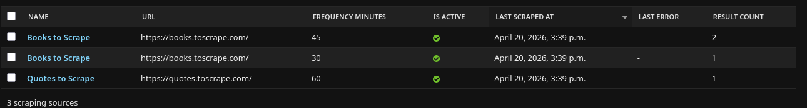
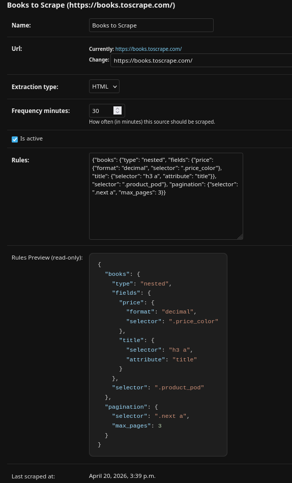
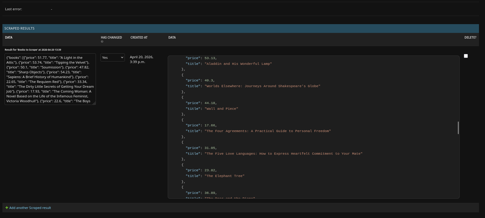
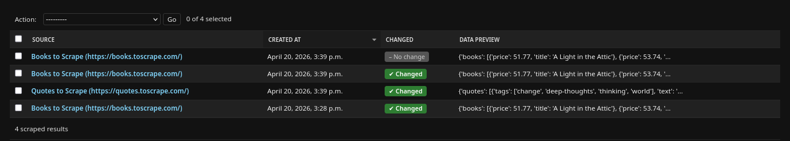
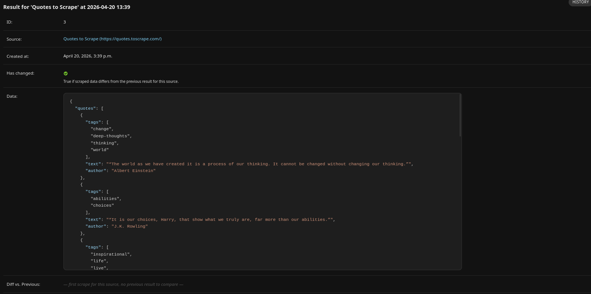

# 🕷️ Configurable Scraping System

A production-ready scraping engine built with **Django REST Framework**, **Celery**, and **Docker**. Manage scraping sources via REST API and collect data automatically on a configurable schedule.

---

## Quick Start

```bash
git clone <repo-url> && cd Configurable-Scraping-System
cp .env.example .env

# Build the image with local flag (overrides Dockerfile default: production)
docker compose build --build-arg ENVIRONMENT=local
docker compose up -d

docker compose exec web python manage.py migrate
```

### Authentication

1. **Create a superuser** (interactive):
   ```bash
   docker compose exec web python manage.py createsuperuser
   ```

2. **Obtain API token** via login endpoint:
   ```bash
   curl -X POST http://localhost:8000/api/auth/token/ \
     -d "username=<your-username>&password=<your-password>"
   # → {"token": "9944b0..."}
   ```

Use the token in all write requests:

```bash
-H "Authorization: Token <your-token-here>"
```

API → `http://localhost:8000/api/`  
Docs → `http://localhost:8000/api/docs/`  
Admin → `http://localhost:8000/admin/`

### Build Environments

```bash
# Local (runserver + dev tools: pytest, black, flake8)
docker build --build-arg ENVIRONMENT=local -t scraper:local .

# Production (gunicorn, no dev dependencies)
docker build --build-arg ENVIRONMENT=production -t scraper:prod .
```

---

## API Reference

> `GET` endpoints are public. Write operations (`POST`, `PATCH`, `DELETE`) require `Authorization: Token <token>`.

| Method | Endpoint | Description |
|--------|----------|-------------|
| `GET` | `/api/sources/` | List all sources |
| `POST` | `/api/sources/` | Create a source |
| `GET` | `/api/sources/{id}/` | Source detail + 10 latest results |
| `PATCH` | `/api/sources/{id}/` | Update source fields |
| `DELETE` | `/api/sources/{id}/` | Delete source and all its results |
| `POST` | `/api/sources/{id}/run_now/` | Trigger immediate scrape |
| `POST` | `/api/sources/bulk_run_now/` | Trigger all active sources |
| `GET` | `/api/sources/{id}/diff/` | Structural diff of the two latest results |
| `GET` | `/api/results/` | Full result history |
| `GET` | `/api/results/?source={id}` | Filter results by source |
| `GET` | `/api/results/?changed_only=true` | Results where data changed |
| `GET` | `/api/results/?missing_field={field}` | Results where a field is null |

---

## Admin Panel

The system provides a user-friendly management interface via Django Admin. Access it at `/admin/` using the superuser credentials created during setup.

### Screenshots

#### Sources Overview

*Manage all your scraping targets in one place*

#### Source Configuration


*Fine-tune extraction rules and schedules*

#### Scraping Results

*Browse history of all collected data*

#### Result Inspection

*Deep dive into specific result JSON and metadata*

---

## Extraction Rules

Rules are defined per-source as a JSON object. Each key becomes a field in the scraped output.

**HTML (CSS selectors)**

| Field | Required | Description |
|-------|----------|-------------|
| `selector` | ✅ | CSS selector |
| `type` | | `single` (default), `list`, `nested` |
| `attribute` | | `text` (default), or any HTML attribute (`href`, `src`) |
| `format` | | `decimal`, `int`, `bool`, `strip`, `uppercase`, `lowercase` |
| `fields` | | Sub-rules map — required when `type` is `nested` |

**Optional pagination** (top-level `pagination` key):

```json
"pagination": { "selector": ".next a", "max_pages": 5, "delay_between_pages": 1.0 }
```

**JSON (dotted-path)**

```json
"price": { "path": "data.product.price", "type": "single" }
```

---

## Examples

**Books — nested scrape with pagination**
```bash
curl -X POST http://localhost:8000/api/sources/ \
  -H "Content-Type: application/json" \
  -H "Authorization: Token <your-token-here>" \
  -d '{
    "name": "Books to Scrape",
    "url": "https://books.toscrape.com/",
    "extraction_type": "html",
    "frequency_minutes": 30,
    "rules": {
      "pagination": { "selector": ".next a", "max_pages": 3 },
      "books": {
        "selector": ".product_pod",
        "type": "nested",
        "fields": {
          "title": { "selector": "h3 a", "attribute": "title" },
          "price": { "selector": ".price_color", "format": "decimal" }
        }
      }
    }
  }'
```

**Quotes — nested with list field**
```bash
curl -X POST http://localhost:8000/api/sources/ \
  -H "Content-Type: application/json" \
  -H "Authorization: Token <your-token-here>" \
  -d '{
    "name": "Quotes to Scrape",
    "url": "https://quotes.toscrape.com/",
    "extraction_type": "html",
    "frequency_minutes": 60,
    "rules": {
      "quotes": {
        "selector": ".quote",
        "type": "nested",
        "fields": {
          "text":   { "selector": ".text" },
          "author": { "selector": ".author" },
          "tags":   { "selector": ".tag", "type": "list" }
        }
      }
    }
  }'
```

**Trigger immediate scrape (requires token)**
```bash
curl -X POST http://localhost:8000/api/sources/{id}/run_now/ \
  -H "Authorization: Token <your-token-here>"
```

**Trigger all active sources (requires token)**
```bash
curl -X POST http://localhost:8000/api/sources/bulk_run_now/ \
  -H "Authorization: Token <your-token-here>"
```

**Diff — compare the two latest results for a source (public)**
```bash
curl http://localhost:8000/api/sources/{id}/diff/
```
```json
{
  "diff": {
    "changed":   { "price": { "from": 29.99, "to": 34.99 } },
    "unchanged": { "title": "A Light in the Attic" },
    "added":     {},
    "removed":   {}
  }
}
```

---

## Future Roadmap

- [ ] **Dynamic Scraping Support (Selenium)**:
    - Add support for JavaScript-rendered pages by integrating Selenium/Playwright.
    - Allow manual selection of the scraping engine per source.
    - Implement an automatic fallback to Selenium if the standard BeautifulSoup engine fails to find elements.
- [ ] **Web Dashboard**:
    - Build a modern frontend (e.g., Next.js) for easier source management and data visualization.